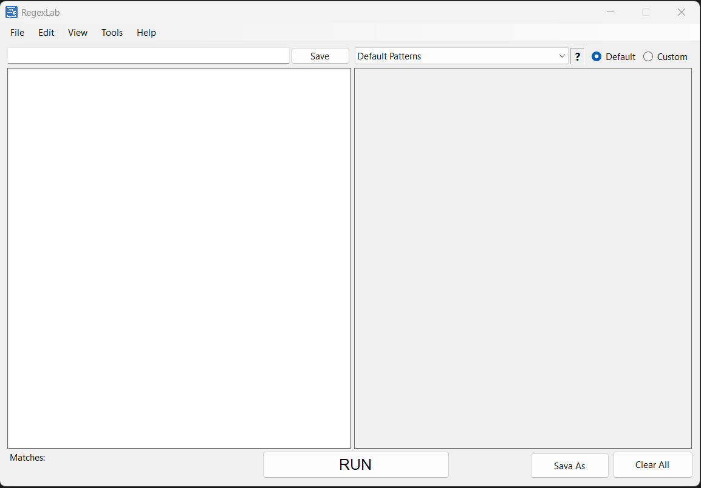
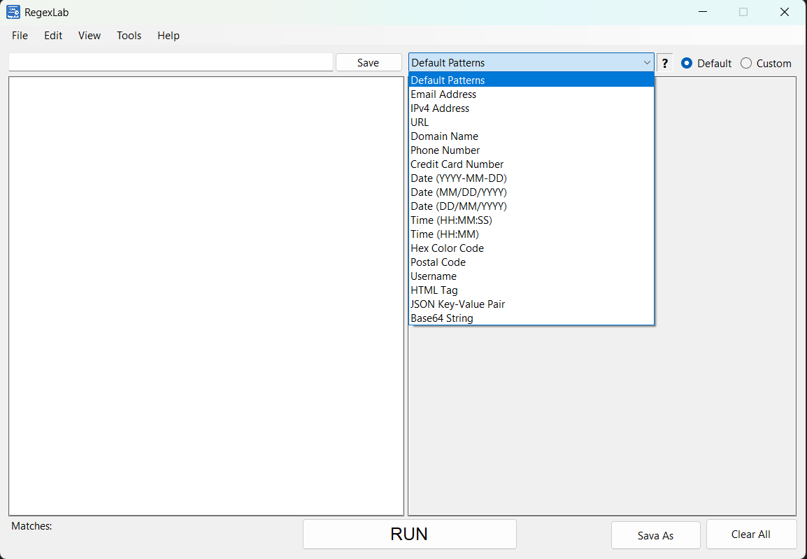
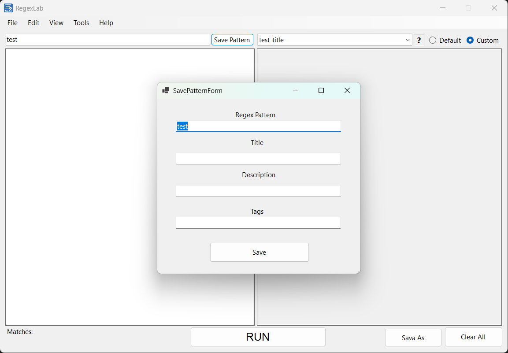

# RegexLab

**RegexLab** is a modern, lightweight, and extensible desktop application for testing, organizing, and exporting Regular Expressions (RegEx). Built with C# and Windows Forms, it aims to be both beginner-friendly and powerful for advanced users.

---

## 🚀 Features

- 🎯 **Regex Tester**

  - Paste or type your input text and test against any regex pattern
  - Real-time match count and extracted results

- 📚 **Pattern Library**

  - Built-in "Default Patterns" for common tasks (Email, URL, IP, etc.)
  - Save your own custom patterns with title, description, and tags
  - Filter between Default and Custom via radio buttons

- 📅 **Export Results**

  - Export matched results as `.txt` or `.json` files
  - Save As dialog with automatic formatting

- 🧰 **Text Processing Options**

  - Duplicate filter
  - Ignore case
  - Trim spaces
  - Sort alphabetically

- 🍗 **Theme Toggle**

  - Dark Mode and Light Mode support (via View > Dark Theme)

- 🛝 **Multi-Panel UI**

  - Input and Output areas side-by-side via SplitContainer
  - Responsive resizing support

- 🧠 **Helpful Menus**

  - File, Edit, View, Help menus with useful tools and links
  - Regex reference, keyboard shortcuts, GitHub link, update checker

---

## 🖼️ Screenshots





---

## ⚙️ Technologies Used

- Language: **C#**
- Framework: **.NET 8.0**
- UI: **Windows Forms**
- Data: **JSON** for pattern storage

---

## 📁 Project Structure

```
RegexLab/
├── Models/               # RegexPattern model
├── default_patterns.json # Built-in patterns
├── saved_patterns.json   # User-saved patterns
├── Form1.cs              # Main interface
├── SavePatternForm.cs    # Pattern saving form
├── README.md             # This file
└── ...
```

---


## 🔧 How to Run

⚠️ Requires .NET 8 Desktop Runtime → [Download here](https://dotnet.microsoft.com/en-us/download/dotnet/8.0)

1. Clone the repository:

```bash
git clone https://github.com/Zulwatha/RegexLab.git
```

2. Open `RegexLab.sln` in Visual Studio
3. Make sure you have `.NET 8.0 SDK` installed
4. Press `F5` to run the app

---

## 📌 License

This project is licensed under the [MIT License](LICENSE).

---

## 👨‍💻 Author

Developed by **Zulwatha**\
Feel free to connect or contribute!\
🔗 [github.com/Zulwatha](https://github.com/Zulwatha)
